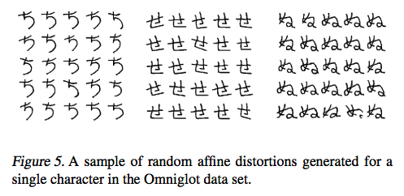

# One shot learning siamese network for omniglot dataset
### Implementation of the following paper
Siamese Neural Networks for One-shot Image Recognition (Gregory et.al)

### Requirements


1.   Pytorch >= 0.4.0
2.   Python 3.5+

### Implementation details
1.  First download the Omniglot dataset
2.  Unzip the data in workspace as images_background and images_evaluation
3.  Run my_dataset as
```shell
python3 my_dataset.py
```
This will extract the alphabets from the images_background and store it in training folder as individual training class. One needs to do this for the test dataset as well
4.  Train and test the data
```shell
python3 train.py
```

## Deep Siamese Networks for Image Verification 
Siamese  nets  were  first  introduced  in  the  early  1990s  by
Bromley and LeCun to solve signature verification as an
image matching problem. A siamese neural network consists of twin networks which accept distinct inputs but are joined by an energy function at the top. This function computes some metric between the highest-level feature representation on each side. Also, the network is symmetric, so that whenever we present two distinct images to the twin networks, the top conjoining layer will compute the same metric as if we were to we present the same two images but to the opposite twins.

The aim is to  first  learn  a  neural  network  that  can  discriminate between  the  class-identity  of  image  pairs,  which  is  the standard verification task for image recognition.  The verification model learns to identify input pairs according to the probability  that  they  belong  to  the  same  class  or  different classes.  This model can then be used to evaluate new images, exactly one per novel class, in a pairwise manner against the test image.  The pairing with the highest score according to the verification network is then awarded the highest  probability  for  the  one-shot  task.   If  the  features learned by the verification model are sufficient to confirm or deny the identity of characters from one set of alphabets,  then they ought to be sufficient for other alphabets, provided that the model has been exposed to a variety of alphabets to encourage variance amongst the learned features.

</img>

## Siamese Networks

Siamese network is a Deep Nueral Network architecture proposed by ***Gregory et. al*** [Siamese Neural Networks for One-shot Image Recognition](http://www.cs.utoronto.ca/~gkoch/files/msc-thesis.pdf). The paper proposes an architecture where using Convolutional Nueral Networks one can tackle the problem of One Shot Learning.

The model aims to solve the basic problem of **image verification**, given that we have very few samples of image of each class or category

The models aims to learn the embeddings of 2 separate images fed into the Nueral Network, the two embeddings are used to calculate the L1 distance between the 2 embeddings.
Once the distance embedding metric is calculated, the embedding is fed into a sigmoid unit which by the magic of back propogation, learns the correct set of hyperparameters to carry out the image verification.

</img>
<caption><center> <u> <font color='black'> **Figure 3**</font> </u></center></caption>


The model of Siamese network can be described as CNN architecture with 2 arms, a right arm and a left arm. The CNN architecture of a single arm has 9 layers, including Max Pooling and Convolutional layers of different filter sizes, as described in the paper. These 9 layers work as feature selectors for the CNN architecture. Convolutional layers are initialized with weights having **0 mean 0.01 standard deviation**, also the bias hyperparameter of the these layers is initialized with a **mean value of 0.5 and a standard deviation of 0.01**.

The basic intuition that once can gain from the paper is that it uses the L1 distance between the pixels of 2 different images as a metric of similarity.
 - If 2 images are similar the L1 distance between them will be lower as compared to the L1 distance computed for 2 somewhat different images.
 - The L1 distance computed is then used to train the sigmoid unit to find the write set of hyperparameters.

### Dataset- Omniglot
Omniglot of Lake et al. is a MNIST-like scribbles dataset with 1623 characters with 20 examples each. The large number of classes (characters) with relatively few data per class (20), makes this an ideal data set for testing few-shot classification.
</img>

### Results

Precision ~ 86%
loss value sampled after each 100 batch
</img>


